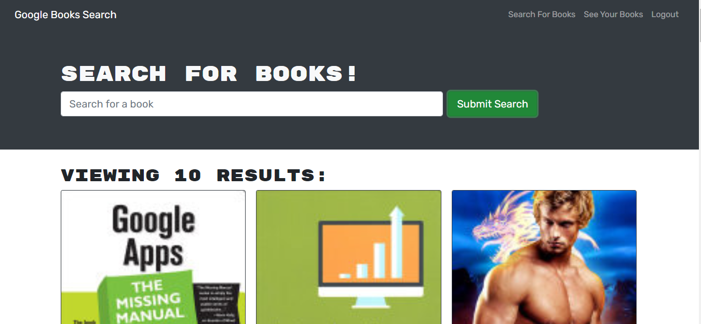
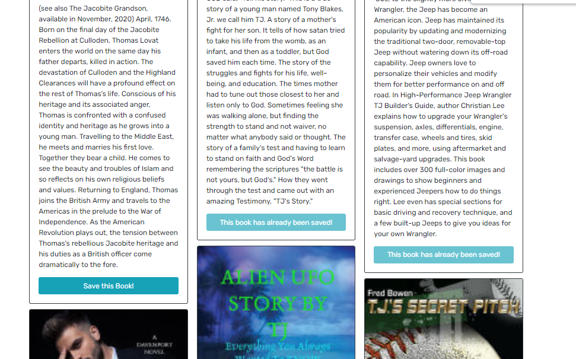
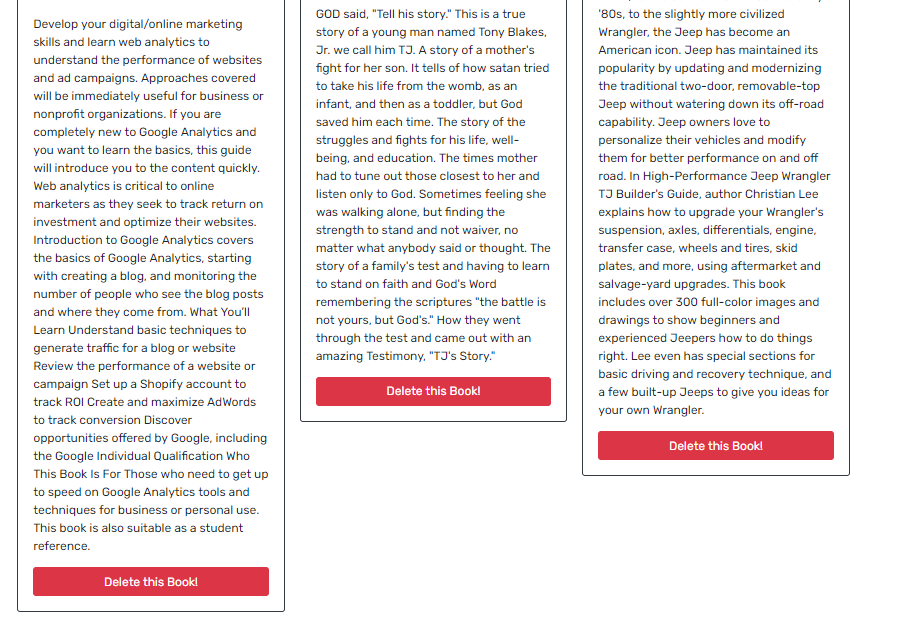

# Book Search Engine

## About The Project :

`Book Search Engine is a MERN stack application where an avid reader can search for new books to read and can keep a list of books to purchase.`

## Table of Contents

- [Link of the website](#link-of-the-website)
- [Features](#features)
- [Technologies Used](#technologies-used)
- [Application Previews](#application-previews)
- [License](#license)
- [Got Any Questions](#got-any-questions)

## Link of the website:

https://tinkubansal-book-search-engine.herokuapp.com/

## Features

This application has the following features:

- Application's homepage includes option to search for books, view saved books and login/signup.
- Once loggedIn, User is redirected to search for books.
- On 'Search for books' page, user is presented with an input field to search for books and a submit button.
- Once user enters a search term in the input field and clicks the submit button, user is presented with several search results, each featuring a book’s title, author, description, image, and a link to that book on the Google Books site and a button to save a book to user's account.
- User can save the book’s information to their account by clicking on the Save button on a book.
- On 'Saved books' page, user can view all of the books User have saved to their account, each featuring the book’s title, author, description, image, and a link to that book on the Google Books site and a button to remove a book from their account.
- User can delete a saved book from their saved books list using remove button on a book.
- User can logout by using logout button. When user clicks on the logout button, then user is logged out of the site and presented with a menu with the options Search for Books and Login/Signup and an input field to search for books and a submit button.

## Technologies Used:

- MERN
- Graphql
- JWT
- JavaScript
- Node.js
- Express.js
- npm
- MongoDb
- Mongoose
- HTML
- CSS

## Application Previews:

## Got Any Questions

Feel free to reach me through
tinkubansal21@gmail.com

## License

Licensed under the [MIT](https://github.com/tinkubansal95/book-search-engine/blob/main/LICENSE) license.

---

© 2021
